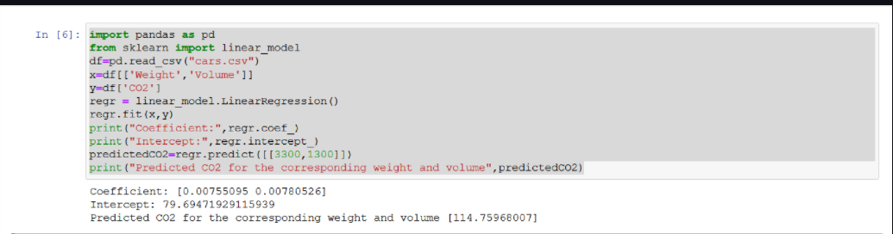

# Implementation of Multivariate Linear Regression
## Aim
To write a python program to implement multivariate linear regression and predict the output.
## Equipment’s required:
1.	Hardware – PCs
2.	Anaconda – Python 3.7 Installation / Moodle-Code Runner
## Algorithm:
### Step1
Import pandas.

### Step2
Import linear_modal from sklearn.

### Step3
Read the file using read_csv.

### Step4
Get the inputs from the user as x and y.

### Step5
Use regr.fit(x,y) to et the output.

## Program:
```
import pandas as pd
df = pd.read_csv('data.csv')
print(df.head(10))
print(df.tail())
print("No of rows",len(df.axes[0]))
print("No of columns",len(df.axes[1]))

```
## Output:


### Insert your output
Coefficient: [0.00755095 0.00780526]

Intercept: 79.69471929115939

Predicted CO2 for the corresponding weight and volume [114.75968007]
## Result
Thus the multivariate linear regression is implemented and predicted the output using python program.